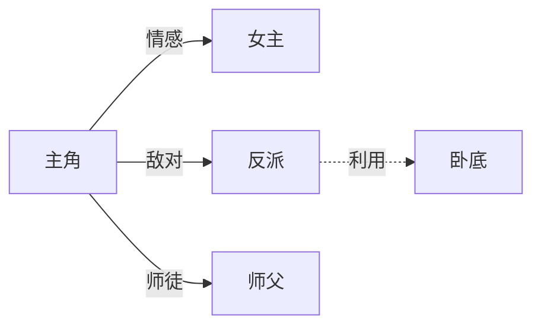

# 使用示例

本文件为 SKILL.md 的应用示例，按需参考。

## 示例一：选题卡

**用户**：我想在番茄写一本末世小说，帮我看怎么选题。

**输出《选题卡》**：

| 项 | 内容 |
|---|---|
| 平台 | 番茄小说 |
| 题材 | 末世+异能+囤物资 |
| 核心卖点 | 重生预知+空间囤货+末世前夕倒计时 |
| 目标读者 | 番茄下沉读者，重爽点、快节奏 |
| 对标作品 | （联网检索"番茄 末世 排行 2026"后填入实时热门） |
| 差异化 | 加入"闺蜜/亲情"情感线，区别于纯独狼流 |
| 风险点 | 末世题材同质化高，需在前3章打出差异；囤货流易流水账 |
| 节奏 | 日更、短章、每章末钩子；前3章首爽点 |

## 示例二：大纲骨架（卷纲）

**题材**：末世重生+异能+找亲人

**卷纲模板**：
```
第一卷 暴雨之夜（共X章，目标Y万字）
【卷目标】开局即入局：穿越/重生、觉醒、首杀、目标锁定；卷末递交XX申请衔接下卷。
【阶段一 入局（1-6章）】…
【阶段二 扎根（7-18章）】…
【感情线】…
【打脸节奏】每10章一个打脸（第10/18/21/32/52章）
【卷末钩子】…
```

**自检**：每10章爽点✓ 卷末钩子✓ 金手指成长曲线✓ 伏笔埋设✓

## 示例三：章纲条目格式

```
第N章 章节名：一句话梗概（谁做什么、遇到什么、结果如何）。
章末钩子：留一个悬念/反转/危机，勾住读者翻下一章。
```

## 示例四：热点追踪（联网）

**用户**：现在番茄起点什么题材火？

**流程**：
1. WebSearch：`番茄小说 热门榜单 2026`、`起点中文网 风云榜 2026`
2. WebFetch 榜单页，提取：书名/题材/字数/追读/简介/评论高频词
3. 整理为表格，标注来源与日期
4. 与 reference.md「题材分类」交叉，给出"当前热点+通用规律"组合建议

**输出格式**：
```
| 排名 | 书名 | 题材 | 追读 | 来源 | 日期 |
|---|---|---|---|---|---|
| 1 | … | … | … | 番茄热门榜 | 2026-08-18 |
```
> 注：实时数据需联网获取，本 skill 不臆造。

## 示例五：硬伤自查

用户给出卷纲/章纲/正文，按 reference.md「常见硬伤清单」逐项检查，输出：
- 🔴 必改 / 🟠 建议改 / 🟡 可改
- 每条标注出处（卷/章）与修订建议

## 示例六：去 AI 痕迹·真人化

**用户**：把这段去 AI 味，像真人写的。

**AI 味原文**：
> 他不禁缓缓转身，眼中闪过一丝不易察觉的温柔。仿佛时光在这一刻凝固，他淡淡地开口，声音宛如低沉的大提琴："我等你很久了。"嘴角勾起一抹若有若无的弧度，却藏着说不尽的沧桑。

**诊断**：命中"不禁/缓缓/眼中闪过/仿佛此刻/淡淡地/宛如/嘴角勾起/一抹弧度/沧桑"等 AI 高频词；情感贴标签；比喻雷同；句式工整。

**真人化改写**：
> 他转过身。"等你好久了。"声音有点低，像怕吵醒什么。他看着她，没再说话。

**说明**：删高频词；情感由动作/停顿呈现；短句交错；留白不点破；保留原意（等待、温柔）。

**自检口诀**：读顺✓ 无高频词✓ 句式不工整✓ 情绪未说破✓ 章末未点题✓

## 示例七：灵感脑洞→可写故事

**用户脑洞**：一个人能听见别人心里对他的评价。

**输出《灵感卡》**：
- 核心脑洞：普通人能听见他人对自己的内心评价，靠这能力在职场/情感中翻盘。
- 题材定位：都市+异能+爽文，番茄向。
- 金手指：心声读取；代价是越用越头疼、且会听到不想听的真话。
- 主线：被低估→靠心声识人破局→卷入利益斗争→真相反转→收束。
- 卖点：识人破局爽点、反差打脸、情感悬念。
- 风险：能力易开挂、需加代价与局限。
- 可选走向：A 职场逆袭 B 情感悬疑 C 悬疑破案。

## 示例八：书名与简介

**脑洞**：末世前重生囤物资找闺蜜。

**书名备选**：
- 直白：《末世重生：我靠空间囤满物资》
- 悬念：《我在末世找闺蜜》
- 反差：《重生末世，闺蜜把我塞进安全屋》

**番茄短简介**：
> 重生回末世前三天。空间、物资、还有那个把我推下楼的闺蜜。这辈子，我先动手。

**起点长简介**：（含背景+金手指+主线+卖点+钩子，200-400 字）

## 示例九：角色卡与关系图

**角色卡（主角）**：姓名/身份/性格/能力/动机/弧光/标志动作/弱点（按模板填）。

**关系图**：


## 示例十：续写正文

给定前文+章纲，按人称/文风接续，推进当前章目标，章末留钩子，字数按平台；可叠加去 AI 痕迹润色。

## 示例十一：投稿评估表

按 reference.md「投稿标准」逐项输出 ✅/⚠️/❌ 与修改建议。
