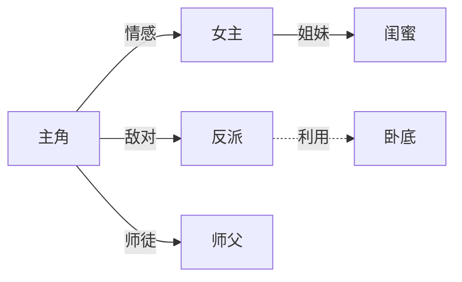

# 网文创作参考库

本文件为 SKILL.md 的详细参考，按需读取相应章节。

## 一、平台特点对比

| 平台 | 调性 | 主流题材 | 读者特点 | 篇幅/节奏 |
|---|---|---|---|---|
| 番茄小说 | 免费、下沉、快爽 | 都市、系统、重生、赘婿、神医、末世、种田 | 碎片化阅读、重爽点、低耐心 | 日更快、短章、强钩子 |
| 起点中文网 | 付费、资深、体系 | 玄幻、仙侠、科幻、历史、游戏、悬疑 | 体系党、考据、重设定 | 长篇、慢热可接受、重世界观 |
| 通用 | — | 全题材 | — | 视目标平台调整 |

**要点**：番茄重"前3章定生死"，起点可"前30章铺垫"但需体系感。先确认目标平台再定节奏。

## 二、题材分类与热度（通用规律，非实时）

### 高热度题材
- **都市**：神医/赘婿/战神/回归/兵王/学霸/直播
- **玄幻/仙侠**：升级流、宗门、洪荒、修仙体系
- **科幻/末世**：末世求生、异能、星际、机甲
- **历史/架空**：争霸、权谋、种田、改史
- **悬疑/灵异**：规则怪谈、民间怪谈、刑侦
- **游戏/网游**：全息、电竞、副本流
- **女频**：宫斗、宅斗、甜宠、年代、种田、快穿

### 常见组合（题材×设定）
- 末世+异能+囤物资 / 重生+年代+种田 / 系统+都市+神医
- 玄幻+无敌流+扮猪吃虎 / 悬疑+规则怪谈+副本
- 赘婿+战神+隐藏身份 / 学霸+科技+报国

> 实时热度请联网检索（见 SKILL.md「联网检索」）。

## 三、读者画像与喜好

### 番茄读者
- 碎片时间、免费入口、跳读率高
- 偏好：强爽点、低门槛、代入感、快节奏、爽文
- 反感：拖沓、说教、复杂设定、主角憋屈过久

### 起点读者
- 付费意愿、追更稳定、评论活跃
- 偏好：体系严谨、伏笔回收、世界观、配角立体
- 反感：金手指失衡、设定崩、水字数

### 通用爽点公式
压抑 → 反转 → 回报 → 装逼 → 打脸
- 压抑要适度（别让主角憋超过 2-3 章）
- 反转要突然但合理（伏笔前置）
- 回报要超额（读者期待×1.5）

## 四、结构模板

### 单线升级流（最稳）
- 主角+金手指+目标，逐级打怪升级
- 每 10-20 章一个小高潮，每 50-80 章一个大高潮
- 卷结构：目标→试炼→挫折→突破→打脸→新目标

### 多线群像
- 2-4 条 POV 线交织，每卷收束一次
- 适合起点体系流、悬疑、历史

### 单元剧
- 一个副本/案件一单元，主线暗推
- 适合悬疑、怪谈、网游

### 流派融合
- 主题材+副题材（如末世+感情、玄幻+搞笑）
- 副线调节节奏、扩受众

## 五、节奏公式

### 黄金三章（开篇）
- 第1章：主角处境+金手指亮相+核心冲突雏形
- 第2章：首个小爽点（打脸/逆袭/救人）
- 第3章：确立目标+第一个钩子（悬念/敌人/约定）

### 高潮密度
- 小高潮：每 10 章一个（打脸/升级/获得）
- 大高潮：每 50-80 章一个（卷末决战/真相揭示）
- 卷末钩子：必留悬念衔接下卷

### 章末钩子类型
- 悬念型（"她身后是谁"）/ 反转型（"他居然是…"）/ 危机型 / 约定型 / 真相型

## 六、套路库

### 金手指类型
系统流 / 面板流 / 血脉觉醒 / 重生预知 / 随身空间 / 签到 / 模拟器 / 概念级能力

### 装逼打脸模式
- 隐藏身份被识破 / 低调被轻视后展露 / 比斗碾压 / 仇人上门被反杀
- 节奏：被嘲讽→主角淡然→出手→震惊全场→反派求饶/认主

### 感情线模板
- 相识→误会→并肩→定情→分离→重逢（虐恋向）
- 欢喜冤家→共患难→双向奔赴（甜向）
- 注意：网文感情线宜"甜不腻、虐不久"，每段虐不超过 1 卷

### 反派设计
- 阶梯式：小反派→中反派→大反派→幕后 BOSS
- 每个反派对应主角一个成长阶段
- 反派要有合理动机，避免纯工具人

## 七、常见硬伤清单（自查用）

- 设定矛盾（能力数值回退、道具归属混乱、血脉/钥匙体系切换）
- 时间线错乱（年龄差、事件先后、跨时间跳跃规则未交代）
- 人物动机崩塌（反派动机突兀升级、关键角色前文零铺垫）
- 节奏拖沓（主角憋屈过久、爽点密度不足、水字数）
- 主角光环失衡（金手指过强无代价 / 过弱憋屈）
- 伏笔不回收 / 卷间衔接断裂
- 闭环悖论（时间线修复/抹除导致因果链断裂）

## 八、写作思路速查

- **选题**：平台×题材×卖点×差异化
- **开篇**：处境+金手指+冲突+钩子，前3章定生死
- **大纲**：卷纲（目标/阶段/感情线/打脸节奏/钩子）→ 章纲（梗概+章末钩子）
- **升级**：金手指成长曲线与代价，避免无敌寂寞
- **收束**：伏笔回收、人物归宿、主题点题

## 九、AI 痕迹清单（诊断用）

逐项扫描文本，命中即标出问题句。

### 9.1 结构痕迹
- 段落高度规整"总—分—总"，每段长度接近
- 过渡词泛滥：首先/其次/然后/接着/综上所述/值得注意的是/不得不说/总而言之
- 每点都用相同句式起头（"不仅…而且…更…"三段排比）
- 列举必凑三点、强行对仗

### 9.2 用词痕迹（AI 高频词）
- 宛如 / 仿佛 / 犹如 / 恍若
- 不禁 / 缓缓 / 淡淡地 / 微微
- 嘴角上扬 / 嘴角勾起 / 眼中闪过一丝 / 眸中掠过
- 一抹 / 一缕 / 一丝（搭配情绪：一抹笑意、一丝落寞）
- 仿佛整个世界都… / 此刻 / 霎时间
- 形容词堆砌：温润如玉、清冷、矜贵、疏离（网文 AI 常见）

### 9.3 表达痕迹
- 情感"贴标签"：直接写"她很悲伤/他很愤怒"，而非用动作细节呈现
- 比喻过密、喻体雷同（"像断了线的风筝""如潮水般涌来"）
- 句式单一、节奏均匀，缺长短句交错
- "的"字过多、长定语堆叠
- 总结性句末点题："是啊，这就是……的意义"

### 9.4 网文专项痕迹
- 章末强行升华/点题，每章都"感悟人生"
- 心理独白过长、反复咀嚼同一情绪
- 爽点写得太"工整对称"，缺意外感
- 对话过于书面、缺乏口语断句与语气词
- 每场打斗都"气势如虹""惊天动地"

## 十、真人化技巧（改写用）

### 10.1 句法
- 打破对称：长短句交错，偶尔用短句/单字句制造节奏
- 删过渡词：直接切入，少用"首先/其次"
- 拆长句：长定语拆成短句，减少"的"字堆叠
- 句末不总结、不点题，留白

### 10.2 呈现
- 用动作/细节代替情感标签："她攥紧杯沿，指节发白"替代"她很紧张"
- 控制比喻密度，喻体求新不求雅
- 留白：不把情绪说破，让读者体会

### 10.3 对话
- 口语化：加语气词、断句、省略、跳跃
- 不同角色语感区分（身份/性格/方言色彩）
- 少用"他郑重地说""她缓缓道"，多用动作带出对话

### 10.4 网文向
- 章末钩子用悬念/反转，不用感悟
- 心理独白压缩到 1-2 句，多靠行动推进
- 爽点写出"意外感"：加一点不规整的细节
- 打斗写具体动作与身体反应，少用大词

### 10.5 自检口诀
读出来顺不顺 → 有没有 AI 高频词 → 句式是否太工整 → 情绪是否说破 → 章末是否点题

## 十一、改写示例

**AI 味**：
> 她不禁缓缓抬起头，眸中掠过一丝复杂的神色，仿佛整个世界都在此刻静止。她淡淡地开口，声音宛如清冷的月光："我没事。"嘴角勾起一抹若有若无的笑意，却透着难以掩饰的落寞。

**真人化**：
> 她抬起头，没看他。"我没事。"顿了顿，又补一句，"真没事。"声音有点哑。

**改了什么**：删"不禁/缓缓/眸中掠过/仿佛此刻/宛如/嘴角勾起/一抹落寞"；情感由标签改为动作与停顿；长短句交错；留白不说破。

## 十二、灵感卡模板

```
【核心脑洞】一句话：谁+什么能力/处境+要干什么
【题材定位】主题材+副题材+平台
【金手指】类型+代价+成长曲线
【主线骨架】起（开篇钩子）→承（试炼升级）→转（真相/挫折）→合（决战收束）
【卖点】3 个差异化爽点
【风险】同质化/设定崩/节奏风险
【可选走向】2-3 个不同结局或转折方向
```

## 十三、书名取名规律

### 13.1 取名类型
- **直白型**：题材+金手指/身份（如《末世之我有一个签到系统》《重生之赘婿战神》）
- **悬念型**：反问/留白（如《我在末世找闺蜜》《谁动了我的命运线》）
- **反差型**：身份反差/错位（如《满级大佬重生后》《神医从摆摊开始》）
- **系列型**：可延展 IP（如"我在XX系列"）
- **梗型**：玩梗/网络语（番茄常见）

### 13.2 平台偏好
- 番茄：直白+梗+长尾关键词，利于搜索与下沉
- 起点：可文气/悬念，重质感
- 通用：避免生僻字、字数 4-12 字、含核心卖点词

### 13.3 自检
- 含核心卖点/题材词 ✓ 利于搜索 ✓ 无生僻字 ✓ 不与热门书撞名 ✓

## 十四、简介公式

### 14.1 番茄短简介（50-150 字）
钩子句（反差/悬念）+ 主角处境 + 金手指 + 核心爽点承诺 + 留白钩。

### 14.2 起点长简介（200-400 字）
背景设定（2-3 句）+ 主角与处境 + 金手指/转折 + 主线目标 + 卖点排比 + 悬念钩子。

### 14.3 模板
```
【一句话钩子】
【背景/处境】
【转折/金手指】
【主线目标】
【爽点承诺】
【钩子】
```

### 14.4 自检
- 前 30 字出现钩子 ✓ 含金手指/卖点 ✓ 不剧透结局 ✓ 字数符合平台 ✓

## 十五、角色卡模板

```
【姓名】
【身份/职业】
【年龄/性别】
【性格】3-5 词 + 一句概括
【能力/金手指】类型+等级+代价
【动机】外在目标+内在需求
【弧光】起点状态→终点变化
【标志动作/口头禅】
【关系】与谁、什么关系、张力点
【弱点/缺陷】避免完美
```

### 主角设计要点
- 有缺陷、有成长、动机清晰
- 金手指有代价，避免无敌寂寞
- 性格鲜明可记（标志动作/口头禅）

### 配角/反派要点
- 配角与主角互补不重复
- 反派有合理动机，阶梯式递进
- 重要配角给独立支线

## 十六、角色关系图（Mermaid）

用 Mermaid `graph` 输出，关系用标签标注：



要点：标关系类型（亲属/情感/敌对/师徒/利益/利用）、标张力点、避免孤立节点。

## 十七、情节节点模板

### 17.1 三幕式
- 起（10-15%）：开篇钩子、金手指、核心冲突
- 承（15-75%）：试炼升级、小高潮、伏笔
- 转（75-90%）：大挫折/真相/逆转
- 合（90-100%）：决战、回收、点题

### 17.2 节点表
```
| 节点 | 触发事件 | 主角变化 | 爽/虐点 | 钩子 | 伏笔 |
|---|---|---|---|---|---|
| 开篇 | … | … | … | … | 埋 |
| 小高潮1 | … | … | 爽 | … | … |
| … | … | … | … | … | … |
| 终局 | … | … | 大爽 | 收束 | 回收 |
```

## 十八、投稿标准

### 18.1 番茄
- 简介：50-150 字，前 30 字出钩子
- 开篇：前 3 章首爽点，金手指亮相
- 字数：建议 2000-3000 字/章，日更
- 书名：直白含卖点词
- 违规：低俗/血腥/政治敏感/导流违规

### 18.2 起点
- 简介：200-400 字，含设定与卖点
- 开篇：前 3 章立人设+金手指，可 30 章铺垫但需体系感
- 字数：3000-5000 字/章
- 书名：可文气/悬念
- 违规：同上 + 抄袭/灌水

### 18.3 通用评估表
```
| 项 | 标准 | 状态 | 建议 |
|---|---|---|---|
| 平台匹配 | 题材契合调性 | ✅/⚠️/❌ | … |
| 书名 | 含卖点/无生僻/不撞名 | … | … |
| 简介 | 字数/钩子/卖点 | … | … |
| 黄金三章 | 金手指/首爽/冲突/钩子 | … | … |
| 节奏 | 爽点密度/章末钩子 | … | … |
| 合规 | 敏感词/违规风险 | … | … |
```
